# معماری کلی سیستم IBO Binary Option Trading Signals

> **افشای ریسک قانونی (الزامی و غیرقابل حذف):**  
> «این سیگنال‌ها توصیه مالی نیستند؛ معاملات باینری آپشن ریسک بالای از دست دادن سرمایه دارد.»

---

## ۱. نمای کلی سیستم (System Overview)
پلتفرم **IBO Binary Option Trading Signals** یک سامانه اختصاصی جهت ارائه و اشتراک سیگنال‌های تحلیلی باینری آپشن بر پایه ترکیب **تحلیلگر انسانی خبره + ارزیابی و تایید هوش مصنوعی (Human-in-the-Loop AI)** است.

این معماری بر اساس **تفکیک دقیق و سخت‌گیرانه ۶ لایه مجزا** طراحی شده است تا حداکثر امنیت، یکپارچگی داده و پایداری را فراهم کند.

---

## ۲. دیاگرام ارتباطی ۶ لایه (Architecture Diagram)

### دیاگرام Mermaid

```mermaid
flowchart TB
    subgraph Layer1["۱. لایه کلاینت و رابط کاربری (Frontend / Client)"]
        UI["رابط کاربری (Android Compose / Web UI)"]
        LocalCache["کش محلی / آفلاین (Room DB)"]
        UI <--> LocalCache
    end

    subgraph Layer2["۲. هسته سرویس و منطق تجاری (Backend Core API)"]
        API_GW["API Gateway / Middleware (Auth JWT, RBAC, Rate Limit)"]
        AuthService["سرویس احراز هویت و کاربران"]
        SubService["سرویس اشتراک و محاسبه انقضا"]
        SignalService["سرویس انتشار سیگنال‌های تاییدشده"]
        AuditService["ثبت و ممیزی لاگ‌ها (Audit Logs)"]
        
        API_GW --> AuthService
        API_GW --> SubService
        API_GW --> SignalService
        API_GW --> AuditService
    end

    subgraph Layer3["۳. پایگاه داده پایدار (PostgreSQL Database)"]
        DB[(PostgreSQL)]
        Tables["کاربران | اشتراک‌ها | تراکنش‌ها | سیگنال‌ها | لاگ‌های ممیزی"]
        DB --- Tables
    end

    subgraph Layer4["۴. لایه وب‌هووک و درگاه‌های خارجی (Webhook / Payment Integration)"]
        WH_Tether["وب‌هووک تتر / رمزارز (NowPayments / On-chain)"]
        WH_Bazaar["وب‌هووک کافه بازار"]
        WH_Myket["وب‌هووک مایکت"]
        WH_Digipay["وب‌هووک دیجی‌پی / اسنپ‌پی"]
        WH_Sheba["وب‌هووک شبا / پایا / پل / ساتنا"]
    end

    subgraph Layer5["۵. لایه اتوماسیون وظایف غیرحساس (n8n Orchestration)"]
        N8N_Engine["موتور n8n"]
        RSS_Worker["دریافت فیدهای خبری RSS"]
        Notify_Worker["ارسال نوتیفیکیشن / ایمیل عمومی"]
        Report_Worker["تجمیع گزارش‌های آماری روزانه"]
    end

    subgraph Layer6["۶. دستیاران هوش مصنوعی و ابزارها (MCP / AI Agents & CLI)"]
        Supervisor["ایجنت ناظر (Agent Supervisor / Governance)"]
        Agent_UI["ایجنت ممیزی UI/UX"]
        Agent_Trans["ایجنت ترجمه و بومی‌سازی"]
        Agent_Img["ایجنت دارایی‌های بصری (Brand DNA)"]
    end

    %% روابط و اتصالات لایه‌ها
    UI -- "درخواست‌های امن با JWT (REST API)" --> API_GW
    
    WH_Tether -- "کال‌بک اختصاصی + امضای دیجیتال" --> API_GW
    WH_Bazaar -- "کال‌بک اختصاصی بازار" --> API_GW
    WH_Myket -- "کال‌بک اختصاصی مایکت" --> API_GW
    WH_Digipay -- "کال‌بک اختصاصی پرداخت اعتباری" --> API_GW
    WH_Sheba -- "ثبت رسید بانکی جهت تایید" --> API_GW

    Backend_Core --> DB
    AuthService --> DB
    SubService --> DB
    SignalService --> DB
    AuditService --> DB

    SubService -- "تریگر رویداد غیرحساس پس از تایید قطعی پرداخت" --> N8N_Engine
    N8N_Engine --> Notify_Worker
    N8N_Engine --> RSS_Worker
    N8N_Engine --> Report_Worker
    N8N_Engine -- "ارسال گزارش تجمیعی" --> API_GW

    Supervisor --> Agent_UI
    Supervisor --> Agent_Trans
    Supervisor --> Agent_Img
    Supervisor -- "اجرای Job از طریق MCP / Token محدود" --> API_GW
```


---

### دیاگرام متنی ASCII (ASCII Flow)
```text
+-----------------------------------------------------------------------------------+
| 1. FRONTEND / CLIENT (Web / Android App)                                          |
|    - نمایش UI/UX، سوییچر زبان، نمایش سیگنال، مدال پرداخت، فرم‌های کاربری         |
|    - Zero Secret: فاقد هرگونه کلید محرمانه، متکی به JWT                           |
+-----------------------------------------+-----------------------------------------+
                                          | HTTPS / REST API + Bearer JWT
                                          v
+-----------------------------------------------------------------------------------+
| 2. BACKEND (Core Service: Node.js / Express / TypeScript)                         |
|    - تنها منبع حقیقت (Single Source of Truth) برای احراز هویت و پرداخت‌ها          |
|    - ارزیابی اشتراک فعال، محاسبه انقضا، تفکیک دسترسی نقش‌ها (RBAC)                |
|    - دریافت سیگنال از تحلیلگر انسانی، تایید با هوش مصنوعی، انتشار به مشترکین فعال|
|    - تایید نهایی امضای دیجیتال درگاه‌ها و ثبت در Audit Log                        |
+-------------------+---------------------+--------------------+--------------------+
                    |                     |                    |
        SQL Queries |                     | Audited Tasks      | Verified Events
                    v                     v                    v
+-----------------------+ +-----------------------+ +-------------------------------+
| 3. POSTGRESQL (DB)    | | 6. MCP / AI AGENTS    | | 5. n8n AUTOMATION             |
|    - کاربران و نقش‌ها | |    - ابزارهای CLI/MCP | |    - ارکستراسیون کارهای غیرحساس|
|    - پلن‌ها و اشتراک‌ها| |    - ایجنت ناظر       | |    - واکشی اخبار RSS        |
|    - تاریخچه سیگنال‌ها| |    - ایجنت ترجمه/UI   | |    - ارسال نوتیفیکیشن و ایمیل|
|    - لاگ‌های ممیزی    | |    - دسترسی محدود Job | |    - فاقد دسترسی به کلید مالی |
+-----------------------+ +-----------------------+ +-------------------------------+
                    ^
                    | نتیجه تایید شده
+-------------------+---------------------------------------------------------------+
| 4. WEBHOOK / EXTERNAL APIS (تفکیک دقیق اندپوینت‌های درگاه‌های ورودی)              |
|    - /api/v1/payments/webhooks/tether      (کریپتو / NowPayments / On-chain)      |
|    - /api/v1/payments/webhooks/bazaar      (کافه بازار)                           |
|    - /api/v1/payments/webhooks/myket       (مایکت)                                |
|    - /api/v1/payments/webhooks/digipay     (دیجی‌پی / اسنپ‌پی)                   |
|    - /api/v1/payments/webhooks/bank-receipt(حواله شبا / ساتنا / پایا / پل)        |
+-----------------------------------------------------------------------------------+
```

---

## ۳. جدول مسئولیت و مرزهای هر لایه (Layer Responsibilities Matrix)

| لایه | عنوان لایه | مسئولیت‌های مجاز (In-Scope) | موارد اکیداً ممنوع (Out-of-Scope / Forbidden) |
| :--- | :--- | :--- | :--- |
| **۱** | **Frontend (کلاینت)** | • نمایش رابط کاربری، تم تاریک سازمانی و ریسپانسیو<br>• مدیریت وضعیت بصری، جهت‌گیری RTL/LTR<br>• ذخیره توکن موقت کاربر در Storage امن<br>• درج دائمی خط سلب مسئولیت ریسک<br>• کش محلی آفلاین با دیتابیس Room | ❌ نگهداری هرگونه کلید محرمانه (API Secret/Private Key)<br>❌ محاسبه یا تصمیم‌گیری پیرامون فعال/منقضی بودن اشتراک<br>❌ تایید مستقیم پرداخت بدون استعلام از سرور<br>❌ درج ادعاهای فریبنده یا سود تضمینی |
| **۲** | **Backend (سرویس اصلی)** | • صدور و اعتبارسنجی توکن‌های JWT و هش رمزعبورها<br>• کنترل دسترسی مبتنی بر نقش (Admin/Analyst/User)<br>• محاسبه قطعی زمان انقضای اشتراک‌ها<br>• فیلتر و انتشار سیگنال‌ها صرفاً برای کاربران مجاز<br>• اعتبارسنجی امضاهای دیجیتال وب‌هووک درگاه‌ها<br>• ثبت تمامی رخدادهای حساس در `audit_logs` | ❌ واگذاری تصمیمات مالی به n8n یا فرانت‌اند<br>❌ ساخت اندپوینت وب‌هووک مشترک برای درگاه‌های مختلف<br>❌ کامیت کردن کلیدها در کد منبع یا ثبت رمزها در لاگ<br>❌ اجرای عملیات پرخطر بدون لاگ ممیزی |
| **۳** | **PostgreSQL (دیتابیس)** | • ذخیره‌سازی داده‌های اصلی با تراکنش‌های اتمیک (ACID)<br>• حفظ یکپارچگی ارجاعی (Foreign Keys & Constraints)<br>• ذخیره مسیر فایل‌های رسید (نه باینری حجیم در DB)<br>• مایگریشن‌های نسخه‌بندی‌شده صریح (`001` تا `007`) | ❌ نوشتن مستقیم داده از سمت ایجنت‌ها بدون لایه ممیزی<br>❌ ذخیره مقادیر خام کلیدها یا داده‌های رمزگذاری‌نشده کارت‌ها<br>❌ اجرای مایگریشن‌های مخرب و خودکار در پروداکشن |
| **۴** | **Webhook / Integration** | • ایجاد اندپوینت‌های مجزا و مستقل برای هر درگاه<br>• اعتبارسنجی امضای رمزنگاری‌شده (HMAC/Signature)<br>• پیاده‌سازی Idempotency Key برای جلوگیری از تراکنش تکراری<br>• تغییر وضعیت پرداخت به صورت اتمیک در بک‌اند | ❌ استفاده از اندپوینت اشتراکی و تجمیع‌شده برای همه درگاه‌ها<br>❌ اعتماد به داده‌های ارسالی کاربر قبل از وب‌هووک سرور-به-سرور<br>❌ فعال‌سازی اشتراک قبل از تایید قطعی وضعیت درگاه |
| **۵** | **n8n (اتوماسیون)** | • دریافت دوره‌ای فیدهای خبری RSS اقتصادی<br>• صدازدن کارهای زمان‌بندی‌شده غیرحساس<br>• ارسال نوتیفیکیشن، پوش یا ایمیل پس از تایید تراکنش<br>• تجمیع و ارسال گزارش‌های آماری روزانه به ادمین | ❌ نگهداری کلیدهای خصوصی درگاه‌های پرداخت<br>❌ تصمیم‌گیری در مورد تایید یا رد تراکنش‌های مالی<br>❌ ایجاد تغییرات بدون نظارت در دیتابیس اصلی |
| **۶** | **MCP / AI Agents & CLI** | • اجرای کارهای مشخص و مجزا (Job Runner) با توکن محدود<br>• تحلیل کمکی متون و ترجمه چندزبانه طبق واژه‌نامه مصوب<br>• ممیزی تطابق رابط کاربری با راهنمای برند و کنتراست<br>• ثبت لاگ شفاف در `agent_audit_logs` قبل از هر اقدام<br>• تابعیت کامل از کلید قطع اضطراری (`Global Kill Switch`) | ❌ دسترسی نامحدود به تمام جداول پایگاه داده<br>❌ اعمال خودکار تغییر روی Production بدون عبور از تست ۱۰ سطحی<br>❌ ایجاد ادعاهای غیرواقعی یا پیش‌بینی‌های قطعی مالی |

---

## ۴. اصول ثابت امنیتی و حاکمیتی (Guiding Governance Principles)

1. **Zero-Trust Frontend**: کلاینت به عنوان یک محیط غیرقابل‌اعتماد در نظر گرفته می‌شود؛ تمام داده‌های ورودی در بک‌اند پاک‌سازی و اعتبارسنجی می‌شوند.
2. **Backend as the Single Source of Truth**: تنها مرجع تصمیم‌گیری در مورد وضعیت مالی، پلن‌ها، اشتراک‌ها و سیگنال‌ها، بک‌اند سرور است.
3. **Dedicated Webhook Endpoints**: هر درگاه پرداخت درگاه و فرمت داده مختص به خود را دارد و اندپوینت اختصاصی با لاگ ورودی و خروجی مجزا خواهد داشت.
4. **Mandatory Risk Disclosure**: متن افشای ریسک یک الزام قانونی و ساختاری است و در کلیه مبادی مرتبط با سیگنال، کارنامه و پرداخت حضور دارد.
5. **Traceable AI Governance**: هیچ هوش مصنوعی اجازه تغییر وضعیت سیستم را بدون ثبت شناسه، سطح ریسک و لاگ در پایگاه داده نخواهد داشت.
