# مستند مسیر کامل خرید اشتراک تا فعال‌سازی و دریافت سیگنال (Part 02)

> **افشای ریسک قانونی (الزامی و دائمی):**  
> «این سیگنال‌ها توصیه مالی نیستند؛ معاملات باینری آپشن ریسک بالای از دست دادن سرمایه دارد.»

این سند مشخص‌کننده دقیق جریان عملیاتی گام‌به‌گام از لحظه کلیک کاربر روی «خرید اشتراک» تا لحظه دریافت بلادرنگ (Real-Time) سیگنال معاملاتی تایید شده است.

---

## ۱. دیاگرام توالی فرآیند ۷ مرحله‌ای (Sequence Diagram)

### الف) دیاگرام Mermaid

```mermaid
sequenceDiagram
    autonumber
    actor User as کاربر (Frontend)
    participant App as اپلیکیشن / کلاینت
    participant API as سرور بک‌اند (Backend Core)
    participant DB as پایگاه داده (PostgreSQL)
    participant Gateway as درگاه‌ها (IAP / NowPayments / BNPL)
    actor Admin as ادمین / بررسی انسانی
    actor Analyst as تحلیلگر انسانی
    participant AI as هوش مصنوعی اعتبارسنج ریسک
    participant Push as سرویس WebSocket / FCM

    %% مرحله ۱ و ۲: انتخاب و ایجاد سفارش
    rect rgb(20, 25, 35)
    Note over User, DB: مرحله ۱ و ۲ — انتخاب پلن و ایجاد سفارش اولیه
    User->>App: انتخاب پلن + انتخاب روش پرداخت
    App->>API: POST /api/orders {planId, paymentMethod}
    API->>DB: INSERT order (وضعیت: PENDING)
    DB-->>API: orderId ثبت شد
    API-->>App: بازگشت orderId (فاقد هرگونه دسترسی تا زمان تسویه)
    end

    %% مرحله ۳: مسیرهای پرداخت
    rect rgb(25, 30, 45)
    Note over User, Gateway: مرحله ۳ — انشعاب مسیر پرداخت بر اساس درگاه انتخابی
    alt الف) اپ‌استورها (مایکت / کافه‌بازار / ایران‌اپس)
        App->>Gateway: پرداخت درون‌برنامه‌ای در استور
        Gateway-->>App: دریافت رسید خرید (Purchase Token / Receipt)
        App->>API: ارسال رسید جهت اعتبارسنجی سرور-به-سرور
        API->>Gateway: استعلام صحت خرید از API رسمی استور
        Gateway-->>API: تایید قطعی اعتبار رسید
        API->>DB: UPDATE order وضعیت -> PAID
    else ب) کارت‌به‌کارت (واریز دستی)
        App->>API: آپلود تصویر رسید واریز
        API->>API: ذخیره ایمن تصویر در Object Storage
        API->>DB: UPDATE order وضعیت -> AWAITING_MANUAL_REVIEW
        Admin->>API: بررسی و تایید تطبیق واریزی در پنل ادمین
        API->>DB: UPDATE order وضعیت -> PAID
    else ج) رمزارز / تتر (NowPayments)
        API->>Gateway: ایجاد فاکتور پرداخت (Create Invoice API)
        Gateway-->>App: هدایت به صفحه پرداخت تتر
        User->>Gateway: انتقال ارز در شبکه بلاکچین
        Gateway->>API: Webhook (IPN) امضاشده پس از تایید بلاکچین
        API->>API: بررسی امضای دیجیتال (HMAC Signature Verification)
        API->>DB: UPDATE order وضعیت -> PAID
    else د) اقساطی BNPL (دیجی‌پی / اسنپ‌پی)
        API->>Gateway: ایجاد پلن اقساط ۴ ماهه
        User->>Gateway: پرداخت قسط اول
        Gateway->>API: Webhook تسویه قسط اول
        API->>DB: ثبت اطلاعات اقساط در جدول installments
        API->>DB: UPDATE order وضعیت -> PAID
    else ه) گوگل‌پلی / درگاه‌های خارجی بدون قرارداد
        App-->>User: نمایش پیام پاپ‌آپ «به‌زودی راه‌اندازی می‌شود» (بدون تراکنش)
    end
    end

    %% مرحله ۴: فعال‌سازی اشتراک
    rect rgb(20, 35, 25)
    Note over API, DB: مرحله ۴ — فعال‌سازی قطعی اشتراک در پایگاه داده
    API->>DB: INSERT/UPDATE subscription (وضعیت: ACTIVE, تاریخ شروع/پایان)
    API->>DB: افزودن دسترسی کاربر به گروه سیگنال‌های VIP
    API-->>App: اعلام موفقیت فعال‌سازی اشتراک
    end

    %% مرحله ۵: ورود و ارزیابی سیگنال
    rect rgb(35, 25, 20)
    Note over Analyst, DB: مرحله ۵ — تحلیل انسانی + اعتبارسنجی هوش مصنوعی
    Analyst->>API: ثبت سیگنال جدید در پنل ادمین (نماد، جهت Call/Put، انقضا، پوزیشن)
    API->>AI: ارسال سیگنال جهت اعتبارسنجی قوانین ریسک (Risk Check)
    alt نقض قوانین ریسک یا ورودی نامعتبر
        AI-->>API: عدم تایید + ذکر خطای مدیریت ریسک
        API-->>Analyst: ارجاع به تحلیلگر جهت اصلاح
    else تایید سازگاری ریسک
        AI-->>API: سیگنال تایید شد (Risk Compliant)
        API->>DB: INSERT signal (وضعیت: APPROVED)
    end
    end

    %% مرحله ۶: انتشار بلادرنگ به مشترکین
    rect rgb(25, 20, 35)
    Note over API, User: مرحله ۶ — انتشار زنده و امن فقط به کاربران فعال
    API->>DB: استعلام لیست کاربران دارای اشتراک ACTIVE
    DB-->>API: بازگشت لیست مجاز
    API->>Push: ارسال سیگنال از طریق WebSocket / FCM
    Push-->>App: دریافت سیگنال توسط کلاینت
    App-->>User: نمایش سیگنال معاملاتی + نمایش الزامی خط افشای ریسک
    end

    %% مرحله ۷: پایان دوره اشتراک
    rect rgb(30, 20, 20)
    Note over API, DB: مرحله ۷ — مدیریت انقضا و سلب دسترسی خودکار
    loop اجرای روزانه (Cron Job / n8n)
        API->>DB: بررسی اشتراک‌های رسیده به تاریخ انقضا
        API->>DB: UPDATE subscription وضعیت -> EXPIRED
        API->>Push: ارسال نوتیفیکیشن تمدید اشتراک به کاربر
    end
    end
```


---

### ب) دیاگرام متنی فرآیند (ASCII Workflow)
```text
[ کاربر در اپلیکیشن ]
       |
       | ۱. انتخاب پلن و روش پرداخت (مشاهده خط افشای ریسک)
       v
[ POST /api/orders ] -------> [ ایجاد سفارش با وضعیت PENDING در PostgreSQL ]
       |                                     |
       |                                     v (بدون دسترسی تا زمان تسویه)
       +==================== انشعاب روش‌های پرداخت ====================+
       |                                                                |
       +--> (الف) اپ‌استورها (مایکت/بازار): اعتبارسنجی رسید سرور به سرور  +--> [ تایید سرور ] --+
       |                                                                |                      |
       +--> (ب) کارت‌به‌کارت: آپلود فیش --> [AWAITING_MANUAL_REVIEW] --> [ تایید ادمین ] -----+
       |                                                                |                      |
       +--> (ج) تتر / NowPayments: وب‌هووک امضاشده پس از تایید بلاکچین --+--> [ تایید وب‌هووک ] -+
       |                                                                |                      |
       +--> (د) اقساطی اسنپ‌پی/دیجی‌پی: وب‌هووک تسویه قسط اول -----------+--> [ تایید قسط ۱ ] --+
       |                                                                                       |
       +--> (ه) گوگل‌پلی / درگاه‌های خارجی: پاپ‌آپ "به‌زودی" (تراکنش متوقف می‌شود)            |
                                                                                               v
[ به روزرسانی سفارش به PAID ] <----------------------------------------------------------------+
       |
       v
[ مرحله ۴: ثبت اشتراک ACTIVE با بازه زمانی در DB و افزودن دسترسی کاربر ]
       |
       +-------------------------------------------------------------+
                                                                     |
[ مرحله ۵: تحلیلگر انسانی ] ---> ثبت سیگنال جدید                     |
                                       |                             |
                                       v                             |
[ هوش مصنوعی ارزیاب ریسک ] ----> اعتبارسنجی قوانین ورود و Payout     |
                                       |                             |
                               (اگر تایید شد)                         |
                                       v                             |
[ ذخیره سیگنال APPROVED در دیتابیس ]                                 |
       |                                                             |
       v                                                             |
[ مرحله ۶: انتشار بلادرنگ از طریق WebSocket/FCM ] <-------------------+
       | (تنها برای کاربران دارای اشتراک ACTIVE)
       v
[ نمایش سیگنال روی گوشی کاربر به همراه درج الزامی خط افشای ریسک ]
       |
       v
[ مرحله ۷: اجرای روزانه Cron Job ] ---> در صورت سررسید انقضا ---> [ وضعیت EXPIRED و قطع دسترسی ]
```

---

## ۲. جدول ماشین وضعیت سفارش‌ها و اشتراک‌ها (State Machine Matrix)

### جدول ۱: وضعیت‌های سفارش (Order States)

| وضعیت (State) | شرح وضعیت | رویداد / تریگر ورودی | وضعیت‌های مجاز بعدی | اقدامات امنیتی و تجاری |
| :--- | :--- | :--- | :--- | :--- |
| `PENDING` | سفارش ایجاد شده؛ کاربر به درگاه یا بخش پرداخت هدایت می‌شود. | کاربر دکمه ثبت سفارش را در کلاینت می‌زند (`POST /api/orders`). | `PROCESSING`<br>`AWAITING_MANUAL_REVIEW`<br>`FAILED`<br>`CANCELLED` | **هیچ دسترسی به سیگنال داده نمی‌شود.** شناسه سفارش با انقضای ۱۵ دقیقه‌ای ایجاد می‌گردد. |
| `PROCESSING` | پرداخت در حال پردازش آنلاین در شبکه بانکی یا بلاکچین است. | درگاه پرداخت کاربر را هدایت کرده یا تراکنش وارد ممپول بلاکچین شده است. | `PAID`<br>`FAILED` | قفل کردن سفارش (Prevent Duplicate Submissions). منتظر دریافت امضای وب‌هووک رسمی سرور. |
| `AWAITING_MANUAL_REVIEW` | کاربر تصویر فیش کارت‌به‌کارت را بارگذاری کرده و منتظر بررسی انسانی است. | آپلود تصویر رسید توسط کاربر به همراه کد ارجاع بانکی. | `PAID`<br>`FAILED` | ذخیره امن فایل در Object Storage، ثبت لاگ جهت جلوگیری از آپلود تکراری فیش، ارجاع به صف تایید اپراتور در پنل ادمین. |
| `PAID` | وجه پرداختی به صورت قطعی وصول و تایید شده است (خودکار یا دستی). | اعتبارسنجی موفق امضای IPN / رسید اپ‌استور / تایید فیش توسط ادمین. | `REFUNDED` | **آغاز فوری فرآیند مرحله ۴ (فعال‌سازی اشتراک).** ثبت شناسه تراکنش در `audit_logs`. |
| `FAILED` | پرداخت ناموفق بود، کاربر انصراف داد، یا رسید توسط ادمین رد شد. | خطای درگاه / عدم تطبیق مبلغ فیش / انقضای زمان پرداخت. | پایان چرخه | عدم ارائه هیچ‌گونه دسترسی؛ ارسال پیام به کاربر جهت تلاش مجدد. |
| `CANCELLED` | سفارش قبل از اقدام به پرداخت توسط خود کاربر لغو شد. | کلیک کاربر روی انصراف از خرید. | پایان چرخه | لغو توکن‌های موقت ایجاد شده در درگاه. |
| `REFUNDED` | مبلغ تراکنش مسترد شده است (با مجوز رسمی مدیر سیستم). | ثبت دستور استرداد با تایید دو مرحله‌ای مدیر ارشد. | پایان چرخه | **لغو فوری دسترسی اشتراک متصل به این سفارش در همان لحظه.** |

---

### جدول ۲: وضعیت‌های اشتراک کاربر (Subscription States)

| وضعیت اشتراک | شرح وضعیت | شرایط فعال شدن | وضعیت دسترسی به سیگنال |
| :--- | :--- | :--- | :--- |
| `INACTIVE` | کاربر ثبت‌نام کرده اما فاقد هرگونه اشتراک است. | حالت پیش‌فرض پس از ثبت‌نام اولیه. | **قطع کامل** (فقط مشاهده تاریخچه عمومی گذشته با تاخیر). |
| `ACTIVE` | اشتراک کاربر معتبر است و زمان انقضا هنوز فرا نرسیده است. | بلافاصله پس از `PAID` شدن سفارش. | **دسترسی کامل و بلادرنگ** از طریق وب‌سوکت و پوش نوتیفیکیشن. |
| `PAST_DUE` | سررسید قسط بعدی (در پرداخت‌های اقساطی دیجی‌پی/اسنپ‌پی) فرا رسیده اما هنوز پرداخت نشده است. | اعلام وب‌هووک تاخیر قسط از سوی ارائه‌دهنده BNPL. | دسترسی موقت در دوره مهلت (Grace Period)، ارسال هشدارهای مکرر پرداخت. |
| `EXPIRED` | دوره زمانی اشتراک به پایان رسیده و تمدید نشده است. | فرا رسیدن زمان انقضا در بررسی Cron Job روزانه. | **قطع فوری دسترسی سیگنال‌های زنده**؛ هدایت به صفحه تمدید پلن. |
| `REVOKED` | اشتراک به دلیل تخلف، نقض قوانین یا استرداد وجه باطل شده است. | اقدام امنیتی ادمین یا رویداد `REFUNDED`. | **مسدودسازی دائم دسترسی** و ثبت علت در لاگ‌های حسابرسی سیستم. |

---

## ۳. نگاشت فنی و نکات اجرایی برای پارت‌های آینده

1. **مدیریت درگاه‌های اقساطی (BNPL):** در صورت پرداخت قسط اول توسط اسنپ‌پی/دیجی‌پی، وضعیت سفارش `PAID` شده و وضعیت اشتراک `ACTIVE` می‌شود. ردیابی اقساط بعدی در جدول مجزای `installments` انجام خواهد شد (پیاده‌سازی اسکیما در Part 03).
2. **بررسی تصویر فیش کارت‌به‌کارت:** تایید فیش تنها نقطه‌ای در معماری است که نیازمند تصمیم‌گیری اپراتور انسانی است؛ زیرا ریسک استفاده از فیش‌های جعلی فتوشاپی بالاست.
3. **تاییدیه هوش مصنوعی برای سیگنال:** هوش مصنوعی در این معماری **نقش اعتبارسنج و دروازه‌بان ریسک (Validator)** را دارد، نه تحلیلگر تولیدکننده. اگر سیگنال تحلیلگر انسانی فاقد حد ضرر، دارای ریسک نامتعارف، یا تایم‌فریم غیرمعتبر باشد، از ورود آن به دیتابیس جلوگیری می‌شود.
4. **تضمین درج سلب مسئولیت:** در تمام خروجی‌های سیگنال، پیام‌های وب‌سوکت و نوتیفیکیشن‌ها، رشته قانونی سلب مسئولیت به صورت غیرقابل تفکیک ضمیمه خواهد بود.
